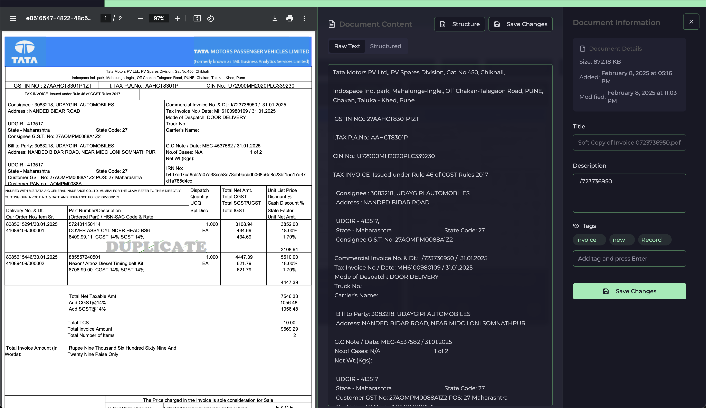

<div align="center">
  <h1>DOCquest</h1>
  <p>🚀 A Modern Document Management System with AI-Powered Features</p>

  [](https://reactjs.org/)
  [](https://www.typescriptlang.org/)
  [](https://tailwindcss.com/)
  [](https://supabase.io/)
  [](https://openai.com/)

  <br/>
  
  
</div>

## ✨ Features

### 🤖 AI-Powered Document Processing
- **Intelligent Document Structuring**
  - OpenAI LLM integration for smart content analysis
  - Automatic document classification
  - Key information extraction
  - Context-aware document summarization

- **Advanced PDF Processing**
  - High-quality text extraction using [markitdown](https://github.com/microsoft/markitdown)
  - Maintains document formatting and structure
  - Converts complex PDFs to clean markdown
  - Table and list recognition

### 🎯 Core Features
- **📄 Smart Document Management**
  - Upload and organize documents effortlessly
  - Automatic text extraction and structuring
  - Real-time search and filtering

- **🔍 Intelligent Search**
  - Full-text search across all documents
  - Filter by tags, date, and type
  - Quick access to recent documents

- **📊 Beautiful Dashboard**
  - Clean, modern interface
  - Document statistics and insights
  - Activity tracking and analytics

### 🎨 UI Features
- **Modern Design**
  - Elegant, responsive layout
  - Dark mode support
  - Smooth animations

- **Rich Components**
  - Interactive document viewer
  - Tag management system
  - Drag-and-drop uploads

## 🧠 AI Integration

DOCquest leverages powerful AI capabilities through its backend:

### OpenAI LLM Integration
- Intelligent document structuring
- Content summarization
- Smart tagging suggestions
- Context understanding

### PDF Processing with markitdown
- Advanced PDF text extraction
- Maintains document structure
- Supports complex layouts
- Clean markdown output

> 📘 **Note**: These features are powered by our backend APIs:
> - **POST `/extract-invoice/`** - Extract structured data using OpenAI
> - **GET `/extract-markdown/`** - Convert PDFs using markitdown
>
> For backend implementation details, visit [DOCquest-API](https://github.com/zerocool909/docquest-api)

## 🛠️ Tech Stack

- **⚛️ Frontend Framework**: React 18 with TypeScript
- **🎨 Styling**: Tailwind CSS with custom UI components
- **📡 State Management**: React Query & Context API
- **🔐 Authentication**: Supabase Auth
- **📦 Storage**: Azure Blob Storage
- **🚀 Build Tool**: Vite

## 🚀 Quick Start

1. **Clone and Install**
```bash
git clone https://github.com/zerocool909/DOCquest_demo.git
cd docquest
npm install
```

2. **Set up Environment**
```bash
cp .env.example .env
```
Update `.env` with your credentials:
```env
VITE_SUPABASE_URL=your_supabase_url
VITE_SUPABASE_ANON_KEY=your_supabase_key
VITE_API_URL=your_backend_api_url
```

3. **Start Development Server**
```bash
npm run dev
```

Visit [http://localhost:5173](http://localhost:5173) to see your app! 🎉

## 🌟 Key Features Showcase

### AI-Powered Document Processing

*Watch as AI automatically structures and extracts information from your documents*

### Smart Search

*Find any document instantly with our powerful search system*

### Beautiful Analytics

*Track your document statistics with our intuitive dashboard*

## 🤝 Contributing

We love contributions! See our [Contributing Guide](CONTRIBUTING.md) for ways to get started.

## 📝 License

MIT © [Your Name] - see the [LICENSE](LICENSE) file for details.

---

<div align="center">
  <p>Check out DOCquest for Digitalisation and paperless future</p>
  <p>
    <a href="https://github.com/zerocool909/DOCquest_demo/issues">Report Bug</a>
    ·
    <a href="https://github.com/zerocool909/DOCquest_demo/issues">Request Feature</a>
  </p>
</div>
